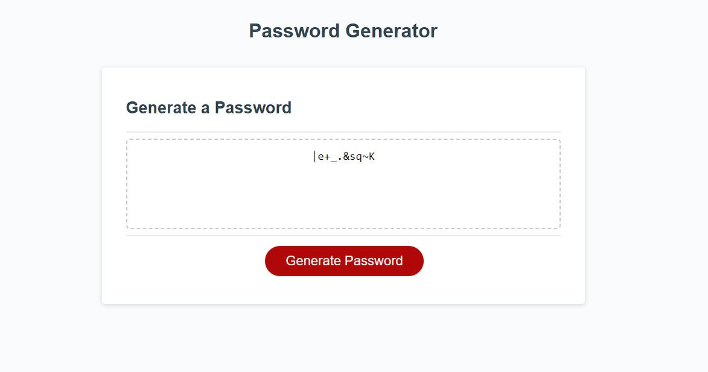

# Week 3 Challange

## Password Generator

This page will serve as a tool to help create a password for a user that can have variations in: character count, special characters, uppercase, and lower case letters.

## Table of contents

-[Display Password](#password)

-[Generate Password](#generate)

## Installation

This code that can be viewed at https://github.com/KobyS82/Week-3-challange/

## Usage

This is a live page that can be viewed at https://kobys82.github.io/Week-3-challange/

 

## Credits

W3 Schools, for reference to Java methods, https://www.w3schools.com/js/js_array_methods.asp

W3 Schools, for Math.Random, https://www.w3schools.com/js/js_random.asp

Stack Overflow, for helping with turning an array to a string, https://stackoverflow.com/questions/4389480/print-array-without-brackets-and-commas

